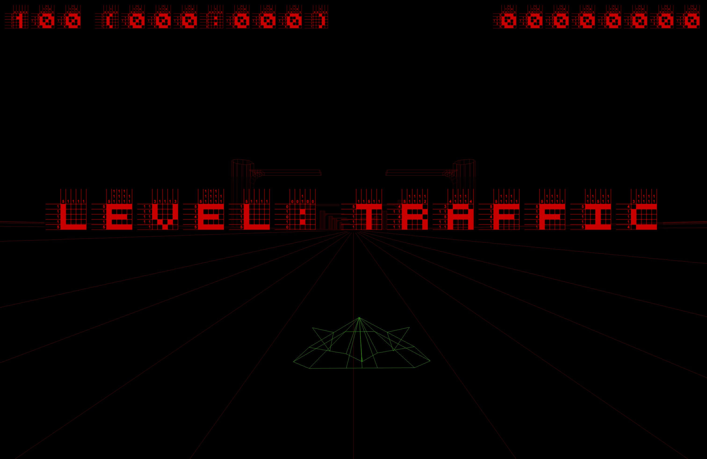

# Imperium: Tux

A 3D rail shooter entry for [PyWeek #8](http://www.pyweek.org/8/).

**Team:** imptux
**Author:** jotham
**Music:** Dylan

Originally written in Python 2 + Pyglet 1.1, migrated to Python 3 + [Arcade](https://api.arcade.academy/) 3.x.



---

## Installation

```bash
python3 -m venv venv
source venv/bin/activate
pip install -r requirements.txt
```

## Running

```bash
source venv/bin/activate
python3 main.py
```

## Controls

| Key | Action |
|-----|--------|
| `A` / `D` | Move left / right |
| `J` | Fire weapon A |
| `K` | Fire weapon B |
| `M` | Toggle music |
| `H` | Toggle help screen |
| `F` | Toggle fullscreen |
| `S` | Screenshot |
| `Escape` | Quit |

## Requirements

- Python 3.8+
- arcade >= 3.0
